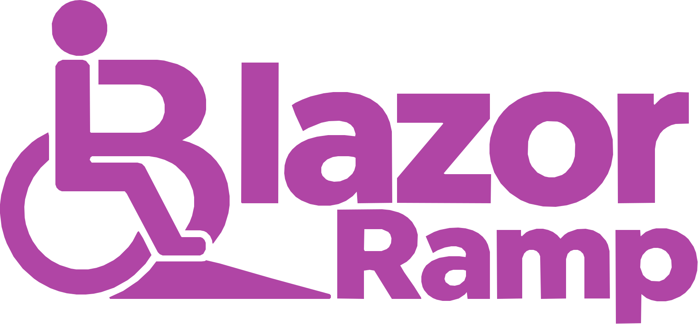

**Accessibility-first Blazor components, developed and manually tested with real screen readers, keyboards, and voice control from day one.**

Blazor Ramp is a suite of modular, accessible Blazor components, delivered individually via NuGet so you only take what you need. Every component is developed *with* a screen reader running, not tested with one as a final checkbox once it's already built.

[](https://github.com/BlazorRamp/Components/blob/main/LICENSE)
[](https://docs.blazorramp.uk)
[](https://blazorramp.uk)

---

## Why Blazor Ramp exists

Every existing Blazor component library I tried had the same pattern: a handful of components were genuinely accessible, and most weren't. Keyboard-only testing failed almost immediately on nearly every site I checked - things that should be a 
five-minute fix in a library that claims to support keyboard users at all.

The common thread was testing method. Most libraries lean on automated tools like axe, and in my experience automated scanners only catch roughly half of real accessibility issues - the mechanical, easy-to-detect ones (missing labels, contrast 
ratios, and so on). They can't tell you whether a screen reader user can actually understand and operate a component, whether focus goes somewhere sensible, or whether a modal actually traps focus the way it's supposed to.

There's also a pattern in this space I have real trouble with: projects that market themselves as accessible, then ask for sponsorship to *fund* screen reader testing. If that testing hasn't happened yet, there's no basis for the accessibility 
claim in the first place - it's building something, calling it accessible, and hoping sponsorship pays to retroactively make that true. Blazor Ramp doesn't work that way. Every component you can install today has already been through the full manual test matrix below, 
before release, not after funding arrives.

## Built from scratch

Blazor Ramp uses no third-party CSS or JavaScript libraries, and doesn't import code from component libraries like Shadcn. Every line - markup, styles, and behaviour - is written from scratch, by hand, specifically for this project.

That means there's no third-party dependency whose accessibility I have to inherit, trust, or work around - if something isn't accessible, it's mine to fix directly, not someone else's package to wait on. It's also part of why contributions need
to be vetted before they're merged (see [Contributing](#contributing) below): the same principle that keeps unvetted third-party code out applies equally to unvetted first-party code.

## How it's tested

Every component is manually verified across:

**Screen reader / browser combinations:**
- Windows 11 - JAWS, NVDA, and Narrator, each paired with Chrome, Edge, and Firefox
- macOS - VoiceOver paired with Safari
- iPhone - VoiceOver paired with Safari
- Android - TalkBack paired with Chrome

**Plus:**
- Keyboard-only navigation
- Voice control, using Windows Voice Access

## Who it's for

Any team building an interactive Blazor site or app that needs to genuinely work for keyboard, screen reader, and voice control users - whether that's driven by a legal requirement (WCAG, Section 508, EN 301 549) or simply wanting to do right by users who 
rely on assistive technology. More broadly, the goal is to help move the needle on web accessibility generally, in an ecosystem where solid, honestly-tested component options have been hard to find.

## See it in action

- **Documentation:** [docs.blazorramp.uk](https://docs.blazorramp.uk) - live, working examples of every component, alongside full API reference.
- **Assistive technology test site:** [blazorramp.uk](https://blazorramp.uk) - the same components, but geared toward trying them out with assistive technology directly. Every test page includes a script describing what the component does and what you 
- should expect to hear/experience.

## Packages
 
Every package automatically references `BlazorRamp.Core` (the live region service and announcement history component), so you don't need to install it separately unless you only want the Core service on its own.
 
| Package | What it provides | NuGet | Version |
|---|---|---|---|
| [`BlazorRamp.Core`](src/BlazorRamp.Core) | The `LiveRegionService` (ARIA live region announcements via `aria-live`), the `<AnnouncementHistory />` component, and the shared CSS custom properties every other package styles itself from. | [NuGet](https://www.nuget.org/packages/BlazorRamp.Core) | [](https://www.nuget.org/packages/BlazorRamp.Core) |
| [`BlazorRamp.CssClasses`](src/BlazorRamp.CssClasses) | A standalone, strongly-typed CSS/BEM class library - grid, flexbox, alignment, spacing, buttons, links, icons, and more - built on the same design tokens as every component. | [NuGet](https://www.nuget.org/packages/BlazorRamp.CssClasses) | [](https://www.nuget.org/packages/BlazorRamp.CssClasses) |
| [`BlazorRamp.Accordion`](src/BlazorRamp.Accordion) | An accessible accordion, with per-item icons and control over collapsed-state persistence. | [NuGet](https://www.nuget.org/packages/BlazorRamp.Accordion) | [](https://www.nuget.org/packages/BlazorRamp.Accordion) |
| [`BlazorRamp.ActionsPopover`](src/BlazorRamp.ActionsPopover) | A lightweight popover for grouping related actions - buttons, links, or a mix - behind a single trigger. Built on the native Popover API and CSS anchor positioning, with forced-colours support out of the box. | [NuGet](https://www.nuget.org/packages/BlazorRamp.ActionsPopover) | [](https://www.nuget.org/packages/BlazorRamp.ActionsPopover) |
| [`BlazorRamp.BusyIndicator`](src/BlazorRamp.BusyIndicator) | A busy/loading overlay - full page or a section of one - that makes the content beneath it inert and relays status changes to screen readers via the live region service. | [NuGet](https://www.nuget.org/packages/BlazorRamp.BusyIndicator) | [](https://www.nuget.org/packages/BlazorRamp.BusyIndicator) |
| [`BlazorRamp.DataTable`](src/BlazorRamp.DataTable) | An accessible, sortable, filterable table for in-memory data, with paging or virtualization, row selection, and cell/column templating. Deliberately not a server-side enterprise grid - you bring a `List<T>`, it handles the rest. | [NuGet](https://www.nuget.org/packages/BlazorRamp.DataTable) | [](https://www.nuget.org/packages/BlazorRamp.DataTable) |
| [`BlazorRamp.DebounceFilter`](src/BlazorRamp.DebounceFilter) | A debounced text filter input - keystrokes are handled in JavaScript on a timer, so your component only re-renders when the (optionally validated) result is ready. | [NuGet](https://www.nuget.org/packages/BlazorRamp.DebounceFilter) | [](https://www.nuget.org/packages/BlazorRamp.DebounceFilter) |
| [`BlazorRamp.DialogFramework`](src/BlazorRamp.DialogFramework) | A modal dialog framework wrapping the native HTML `<dialog>` element, with nested dialog support and correct focus management. | [NuGet](https://www.nuget.org/packages/BlazorRamp.DialogFramework) | [](https://www.nuget.org/packages/BlazorRamp.DialogFramework) |
| [`BlazorRamp.Inputs`](src/BlazorRamp.Inputs) | `EditForm`-compatible Checkbox, Date, Numeric, Password, Radio, TextArea, and Time inputs, plus an Input Error Summary component. Growing steadily with periodic releases. | [NuGet](https://www.nuget.org/packages/BlazorRamp.Inputs) | [](https://www.nuget.org/packages/BlazorRamp.Inputs) |
| [`BlazorRamp.NavGroup`](src/BlazorRamp.NavGroup) | A disclosure-pattern navigation group for side navigation, supporting nested, N-level-deep menus. | [NuGet](https://www.nuget.org/packages/BlazorRamp.NavGroup) | [](https://www.nuget.org/packages/BlazorRamp.NavGroup) |
| [`BlazorRamp.Pager`](src/BlazorRamp.Pager) | A pagination component with button or link-based selectors, announced to screen readers as a navigation landmark. | [NuGet](https://www.nuget.org/packages/BlazorRamp.Pager) | [](https://www.nuget.org/packages/BlazorRamp.Pager) |
| [`BlazorRamp.SkipTo`](src/BlazorRamp.SkipTo) | A "skip to content" link, at site or section level, respecting reduced-motion preferences when moving focus. | [NuGet](https://www.nuget.org/packages/BlazorRamp.SkipTo) | [](https://www.nuget.org/packages/BlazorRamp.SkipTo) |
| [`BlazorRamp.Switch`](src/BlazorRamp.Switch) | An accessible toggle switch, using `role="switch"` and `aria-checked`. | [NuGet](https://www.nuget.org/packages/BlazorRamp.Switch) | [](https://www.nuget.org/packages/BlazorRamp.Switch) |
| [`BlazorRamp.Tabs`](src/BlazorRamp.Tabs) | Accessible tabs with automatic or manual panel activation, and optional per-tab icons. | [NuGet](https://www.nuget.org/packages/BlazorRamp.Tabs) | [](https://www.nuget.org/packages/BlazorRamp.Tabs) |
| [`BlazorRamp.ToggleTip`](src/BlazorRamp.ToggleTip) | A "toggletip" (Heydon Pickering's term) - supplemental content shown on click/keypress/touch rather than hover, built on the Popover API and CSS anchor positioning. | [NuGet](https://www.nuget.org/packages/BlazorRamp.ToggleTip) | [](https://www.nuget.org/packages/BlazorRamp.ToggleTip) |
## Getting started

Every package follows the same install pattern. Using `BlazorRamp.SkipTo` as an example:

**1. Install the package:**

```bash
dotnet add package BlazorRamp.SkipTo
```

**2. Add the Core and component stylesheets to your app's `<head>`** (`App.razor` for Blazor Web App/Server, `wwwroot/index.html` for Blazor WebAssembly):

```html
<link rel="stylesheet" href="_content/BlazorRamp.Core/assets/css/core.min.css" />
<link rel="stylesheet" href="_content/BlazorRamp.SkipTo/assets/css/skip-to.min.css" />
```

**3. Add the Core live-region script, after Blazor's own script:**

```html
<script src="_framework/blazor.web.js"></script>
<script type="module" src="_content/BlazorRamp.Core/assets/js/core-live-region.js"></script>
```

**4. Register Blazor Ramp's services in `Program.cs`** (both server and client projects, if using Server + WebAssembly interactive render modes):

```csharp
using BlazorRamp.Core.Common.Extensions;

builder.Services.AddBlazorRampCore();
```

**5. Add `<AnnouncementHistory />` above the `<Router>` component**, in `Routes.razor` (Blazor Web App/Server) or `App.razor` (Blazor WebAssembly):

```razor
<AnnouncementHistory RefreshText="Refresh" ClearCloseText="Clear & Close" CloseText="Close" NoDataText="No announcements"
    Title="Recent Announcements" TriggerVisible="false" TriggerText="Alerts" />

<Router AppAssembly="..." >
```

From there, drop the component into your markup. Full usage, parameters, and live examples for every component are on the [documentation site](https://docs.blazorramp.uk).

**Note: ** on my sites I have `TriggerVisible="true"` so non-screen reader users can access some of the announcements made.
## Status

This project is under active, in-progress development - new components and packages are being added regularly. Check back often, and see the [releases](https://github.com/BlazorRamp/Components/releases) for what's shipped so far.

## Sponsorship

Blazor Ramp is a one-person effort, built and tested manually across a real matrix of screen readers, browsers, and devices - which takes considerably more time than most component libraries require. Sponsorship isn't funding testing that hasn't 
happened yet; it goes toward making already-rigorous testing sustainable long-term, with the goal of eventually working on Blazor Ramp and web accessibility full time.

*Sponsor tiers and what each tier includes are being finalised - check back soon, or watch this repository for updates.*

## Contributing

Given the amount of manual testing every component goes through (see [How it's tested](#how-its-tested) above), I can't accept unvetted pull requests - a contribution that hasn't been checked against the same screen reader/browser/keyboard matrix 
as everything else in this repo could undo the exact thing this project exists to guarantee.

If you'd like to contribute, please [open an issue](https://github.com/BlazorRamp/Components/issues) first, describing what you'd like to work on. From there we can figure out the right way to get it tested and merged. Bug reports and accessibility 
issues (including anything an automated scanner wouldn't catch) are always welcome without any of that - see the [issue templates](.github/ISSUE_TEMPLATE) to get started.

## Thanks

**[TestingBot](https://testingbot.com)** provides an unlimited open-source plan, giving this project access to real devices for testing.

[](https://testingbot.com)

## License

Apache-2.0 - see [LICENSE](LICENSE).
